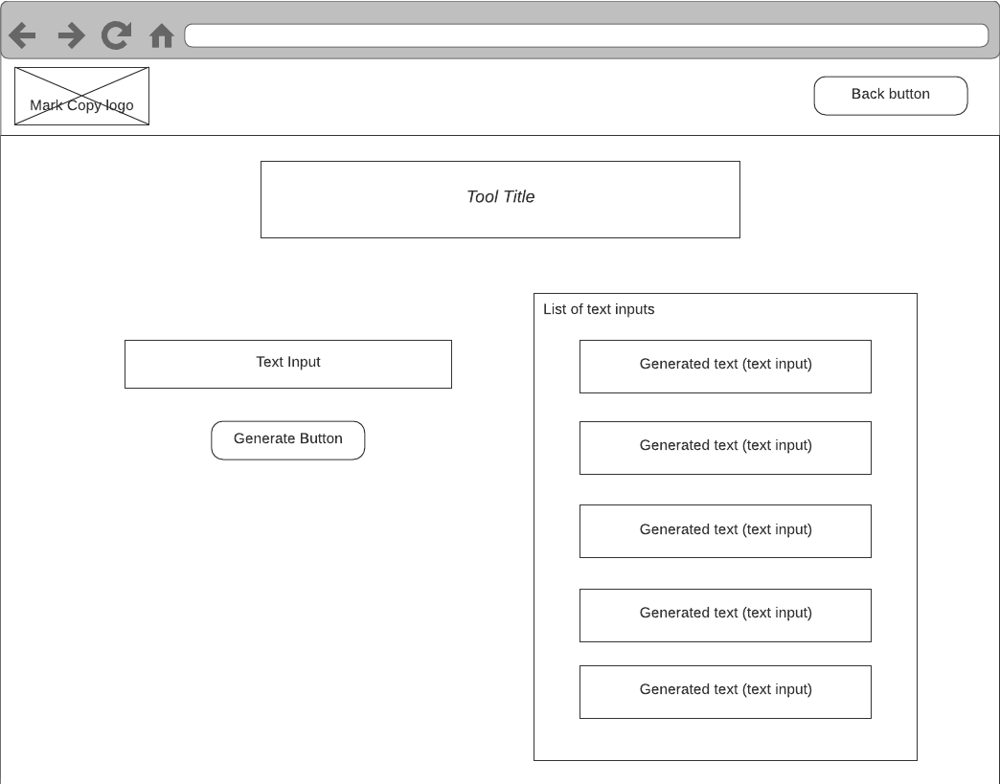

# Mark Copy fullstack technical test

Thank you for taking the time to do our technical test. It consists of two parts:

- A coding project (should take 1.5 to 2 hours, a little more if you have never used Next.js or one of the frameworks)
- A small presentation of your technical choices for solving this problem during the next meeting (5 minutes)

# Tech stack

We chose a stack very similar to what we use at Mark Copy

- Next.js
- React
- Express.js
- Javascript

# Problem to solve

Overview: Your goal is to build a **single page application** that helps to generate marketing content (sounds familiar ? 😇).

The app has 3 templates and the user should be able to access them in 3 separate pages (different URLs). The templates are the following:

- Blog post paragraphs
- Blog post ideas
- LinkedIn post

We already know that in the future the app will have 100s of templates like these (emails, Twitter, etc.), so your goal is to build a scalable solution. Adding any other template should be quick for developers.

**Adding a new template in the future should be done with the least code possible.**
  

These templates have different URL paths and input fields that have constraints on length:

| Template              | URL path                 | Inputs (min length and max length)                                 |
| --------------------- | ------------------------ | ------------------------------------------------------------------ |
| Blog paragraph        | /template/blog-paragraph | **title**: 20 to 120 characters **keyword**: max 30 characters |
| Blog idea             | /template/blog-idea      | **topic**: 20 to 120 characters                                    |
| LinkedIn introduction | /template/linkedin-post  | **topic**: 10 to 500 characters **tone**: max 20 characters    |

 

# Instructions

You can either start from scratch or start from this project (recommended as it should save some setup time)

## 1. Create the app's header component

It contains:

- Mark Copy's logo
- A Back button

## 2. Complete the POST /:templateId/generate endpoint

Unfortunately our external API is still under construction (will be released in November) so we cannot give you the possibility to plug it to this test project for now.

Output content is already provided in the `/data` folder

### Body parameters

Follows the input field names provided in the section "Problem to solve"

### Response

Uses outputs provided in the `/data` folder

JSON object containing:

| Attr name | Type          | Description                                                                     |
| --------- | ------------- | ------------------------------------------------------------------------------- |
| outputs   | array<object> | An array of objects containing an object as such `{ "content": "output text" }` |

## 3. Create a scalable system to create pages for these templates (and more)

This means that a single JavaScript file will be used for the 3 templates but it will be accessed through 3 different URLs. Example:

- /template/blog-paragraph
- /template/blog-idea
- /template/linkedin-post

Wireframe for the page:

Here's how it's supposed to work:

1. The user enters text in the input fields corresponding to the template
2. Once he has completed all the fields, the user clicks on the "Generate" button
3. The user can see multiple generated content on the left.
4. The user can edit each generated content (rendered in an input element)

## Expectations

- Unit tests at least for the API routes you have to create
- Clean and well structured code
- Re-usable components
- Using Next.js features
- Scalable system

## Bonus

Writing code for this part is optional for time reasons but its implementation can be discussed during the next call.

Add a system that would count the number of credits left (starting at 100). Each API request uses 1 credit.

- The number of credits should be decremented on each text generation
- The number of credits left should appear on the app's header component
- The user should not be able to generate content if he has no more credits left

 

# Additional information

## UI

Mark Copy uses Material-UI but you are free to use any other library that you're more comfortable with.

## Data source

We have prepared a set of 2 examples for each template in the `/data` folder.

Each example consist of:

- inputs that you can use (but the user should still be able to type anything he wants on the app)
- outputs that you have to use in the API response.

## Running the project

- Start the server (Express.js)
  `npm run backend`

- Run the application
  In development mode with hot refresh: `npm run dev`

(You're free to use either yarn or npm even though documentation is with npm)

## Deliverable

Preferably a Github repository.
